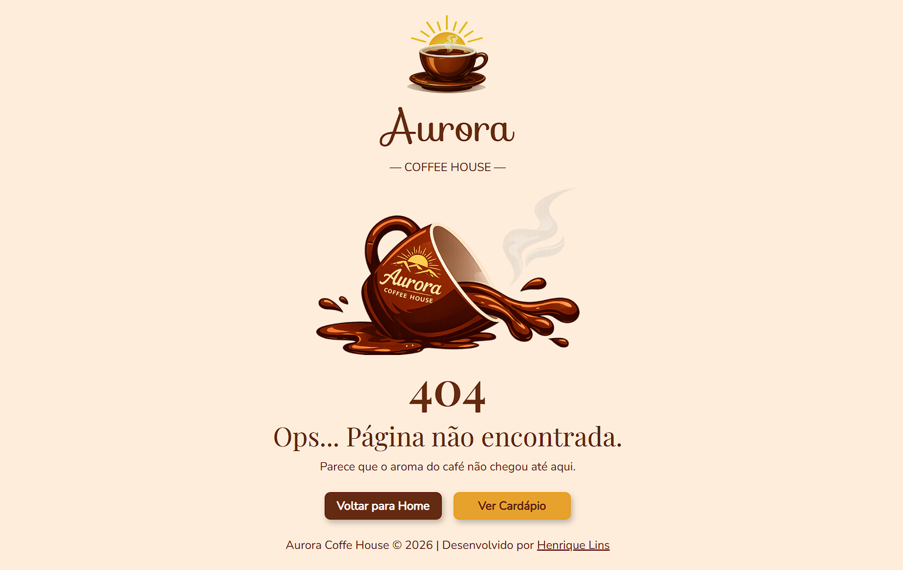

# ☕ Aurora Coffee House - Página 404

Uma página de erro **404 personalizada** desenvolvida para a cafeteria fictícia **Aurora Coffee House**. O objetivo do projeto foi criar uma experiência agradável para o usuário ao encontrar uma página inexistente, mantendo a identidade visual da marca.

## 📸 Desktop

---

## 🚀 Demonstração

🔗 **Acesse o projeto:**  
👉 <a href="https://henriquelins26.github.io/aurora-coffee-404/" target="_blank" rel="noopener noreferrer">Clique aqui para acessar o site</a>

---

## 🎯 Objetivos do Projeto

- Criar uma página 404 personalizada.
- Manter a identidade visual da marca.
- Desenvolver um layout moderno e agradável.
- Aplicar boas práticas de HTML e CSS.
- Garantir responsividade para Desktop, Tablet e Smartphone.
- Melhorar a experiência do usuário mesmo em páginas inexistentes.

---

## 🛠️ Tecnologias Utilizadas

- HTML5
- CSS3
- Flexbox
- Media Queries
- Google Fonts

---

## 📱 Responsividade

O projeto foi desenvolvido para oferecer uma boa experiência em diferentes dispositivos:

- 💻 Desktop
- 📱 Smartphone
- 📲 Tablet

---

## ✨ Funcionalidades

- Página 404 personalizada.
- Layout totalmente responsivo.
- Botões para retornar à Home ou acessar o Cardápio.
- Efeitos de hover nos botões.
- Estados de foco (`:focus-visible`) para melhorar a acessibilidade.
- Imagens responsivas.
- Estrutura organizada utilizando Flexbox.

---

## 📚 Aprendizados

Durante o desenvolvimento deste projeto foram praticados conceitos importantes como:

- Organização do CSS.
- Reutilização de classes.
- Variáveis CSS (`:root`).
- Flexbox.
- Responsividade com Media Queries.
- Boas práticas para imagens responsivas.
- Uso de `box-sizing: border-box`.
- Melhor organização dos espaçamentos utilizando `gap`.
- Acessibilidade básica utilizando `:focus-visible`.

---

## 🎨 Design

O layout foi inspirado na identidade visual de uma cafeteria artesanal.

As escolhas de paleta de cores e tipografia foram definidas com auxílio de Inteligência Artificial, enquanto toda a implementação da interface (HTML e CSS), estrutura, organização do código e responsividade foram desenvolvidas por mim.

---

## 👨‍💻 Autor

Desenvolvido por **Henrique Lins**

- GitHub: <a href="https://github.com/HenriqueLins26" target="_blank" rel="noopener noreferrer">Meu Perfil no GitHub</a>
- LinkedIn: <a href="https://www.linkedin.com/in/henrique-lins-aragao" target="_blank" rel="noopener noreferrer">Meu Perfil no LinkedIn</a>

---